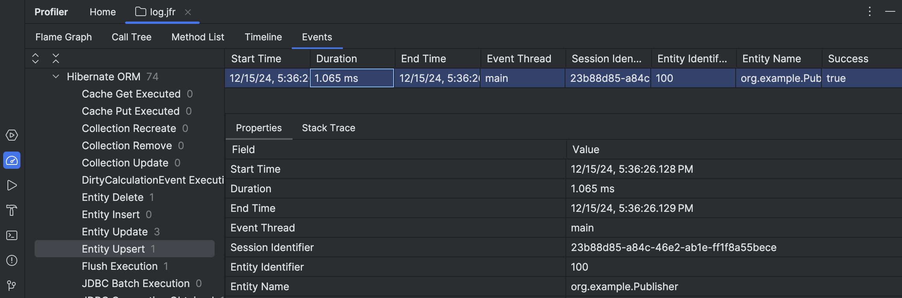

= Tooling
:awestruct-layout: project-standard
:awestruct-project: orm
:page-interpolate: true
:project: #{site.projects[page.project]}
:latest_stable: #{latest_stable_release(page).version}
:version_family: #{latest_stable_release(page).version_family}
:toc:
:toc-placement: preamble
:toc-title: Contents

Hibernate ORM doesn't require the use of special build tools or IDE plugins.
In particular, it does not depend on the use of a bytecode processor.
But _if you're comfortable_ using an annotation processor, bytecode processor, or IDE plugin, we can offer some additional things which are otherwise impossible.

== Tooling for Hibernate ORM

Tooling for Hibernate ORM includes:

- link:/orm/processor/[Hibernate Processor], the annotation processor which produces the Jakarta Persistence static metamodel, validates queries at compilation time, and implements Jakarta Data link:/repositories/[repositories], and
- the link:https://docs.jboss.org/hibernate/orm/{version_family}/userguide/html_single/Hibernate_User_Guide.html#tooling-gradle[Gradle plugin] and link:https://docs.jboss.org/hibernate/orm/{version_family}/userguide/html_single/Hibernate_User_Guide.html#tooling-maven[Maven plugin] which perform optional bytecode enhancement at build time.

Note that containers like https://www.wildfly.org[WildFly] and https://quarkus.io[Quarkus] are able to perform bytecode enhancement automatically, _without_ the Gradle or Maven plugin.

== Relational schema management

Hibernate ORM comes with schema management built in.
Hibernate is able to infer a schema from mapping annotations or XML mappings and link:https://docs.jboss.org/hibernate/orm/7.0/introduction/html_single/Hibernate_Introduction.html#automatic-schema-export[automatically export the schema to the database], or verify that the inferred schema is consistent with the pre-existing schema.
This functionality is especially useful for testing.
The schema management tool can even truncate tables to link:https://docs.jboss.org/hibernate/orm/7.0/introduction/html_single/Hibernate_Introduction.html#testing[clean up between tests].

For more advanced schema evolution needs, Hibernate can be used together with a tool like link:https://github.com/flyway/flyway[Flyway].

== Tools for monitoring and profiling

Hibernate collects statistics as it goes.
Your program can access this information via an API, but some environments report it automatically.

- Hibernate Micrometer reports statistics via link:https://github.com/micrometer-metrics/micrometer[Micrometer].
WildFly, Quarkus, and other Java containers have built-in support for Micrometer.
You can learn more about using link:https://quarkus.io/guides/telemetry-micrometer[Micrometer in Quarkus].

- Hibernate JFR reports persistence-related events to Java Flight Recorder.
No configuration is required: just include the module `org.hibernate.orm:hibernate-jfr` as a runtime dependency and you're all set.

== Hibernate Tools

link:https://tools.jboss.org/features/hibernate.html[Hibernate Tools] is a suite of link:https://eclipseide.org[Eclipse] plugins
and part of link:http://jboss.org/tools[JBoss Tools].

image::https://static.jboss.org/hibernate/images/tools/hibernatetools_screen2.gif[Live HQL query editing,float="right"]

[discrete]
=== Console

The _Hibernate Console_ perspective allows you to configure database connections, provides visualization of classes and their relationships, and allows you to execute HQL queries interactively against your database and browse the query results.

image::https://static.jboss.org/hibernate/images/tools/hibernatetools_screen1.gif[Mapping editor,float="left"]

[discrete]
=== Mapping Editor

The _Mapping Editor_ is an editor for Hibernate XML mapping files, supporting auto-completion and syntax highlighting.
The editor even supports semantic auto-completion for class names, property/field names, table names and column names.

[discrete]
=== Reverse Engineering

Finally, the most powerful feature of Hibernate Tools is a database reverse engineering tool that generates domain model classes and Hibernate mapping files directly from a given database schema.

++++
<a class="ui button right labeled icon a primary" href="/tools/" style="float: right">
  <i class="right arrow icon"></i>
  More about Hibernate Tools
</a>
++++

